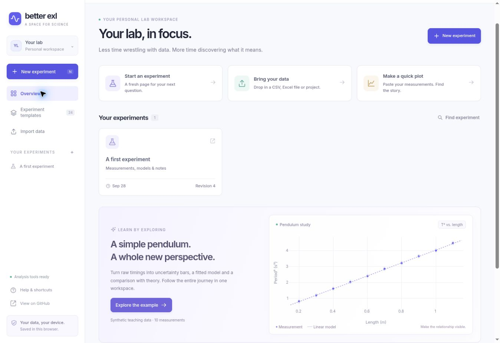

# Better Exl

**Your measurements, uncertainty, models and graphs, together in one lab workspace.**

A Python-powered website for physics students: enter or import measurements, define units and equations, inspect uncertainty, fit models, compare independent predictions and export reproducible results. Use it online without installing Python, or run the local edition on your computer.



## Open the website

**[Launch Better Exl](https://seasonalerror.github.io/Better-Exl/)**

The online edition runs the same scientific engine in a background browser worker using Pyodide, NumPy, SciPy and Pint. You can start entering data immediately. The first analysis downloads Python and its numerical packages, which can take a little time. Keep an internet connection available for loading those tools. No account or API key is required.

Experiments save automatically in **this browser on this device**, not in your GitHub repository or a cloud account. Export **Project backup** to keep a portable copy. Clearing website data, using private browsing or changing browsers can remove or hide your saved workspace. Online and local editions do not sync automatically; project JSON transfers between them.

## Host your own copy on GitHub Pages

1. Fork this repository, or push its files to your own public GitHub repository.
2. Open **Settings → Pages → Build and deployment → Source → GitHub Actions**.
3. Open **Actions → Publish Better Exl website → Run workflow**. Subsequent pushes to `main` publish automatically after the tests pass.
4. Open the website URL displayed under **Settings → Pages** or the deployment summary.

The included workflow builds a static website. There is no server to manage and no secret API key to configure. Every asset path is relative, so repository subpaths work. The numerical runtime is pinned to Pyodide 0.28.3 on jsDelivr; the app code, Plotly, font and extra Python wheels are served with your website.

## Run on your computer

1. Install **Python 3.11 or newer**. On Windows, include the Python launcher (`py`).
2. Download this repository with **Code → Download ZIP**, then extract it, or clone it with Git.
3. **Windows:** double-click `start.bat`. **macOS / Linux:** open a terminal in the extracted folder and run `bash start.sh`.
4. Open **http://127.0.0.1:8765** if your browser does not open automatically. Keep the terminal running while you work.

The first start installs dependencies in a virtual environment. Later starts work offline. Linux may need the distribution's `python3-venv` package. If the port is busy, use `bash start.sh --port 8767` or `start.bat --port 8767`.

Manual setup:

```bash
python -m venv .venv
# Windows: .venv\Scripts\activate
# macOS / Linux:
source .venv/bin/activate
python -m pip install -r requirements.txt
python run.py
```

Use `python run.py --no-browser` for a headless session or `--data-dir /path/to/data` for another storage location. The local edition uses a Python backend; the GitHub Pages edition runs Python inside the browser.

## Included in v1

| Workflow | Features |
|---|---|
| Collect | Multiple experiments/datasets, spreadsheet editing, rectangular paste/copy, search, row inclusion and notes, undo/redo |
| Save | Browser IndexedDB or local SQLite autosave, immutable revisions, conflict protection, recovery of interrupted drafts, JSON project backup/import |
| Import | CSV, TSV, TXT, XLSX; preview, header row, delimiter, decimal comma and worksheet selection; original text retained |
| Calculate | Named formulas, dimensional checks/conversion, scientific/custom constants, uncertainty columns, first-order propagation with shared dependencies, within-row correlations, inspectable budgets |
| Plot | Scatter/line with X/Y error bars, histogram, box, contour, 3D scatter, extra series, log axes, limits and figure styles |
| Edit | Double-click titles, axis labels, legend names and annotations; customize colours, markers and line widths |
| Fit | Linear, polynomial, exponential, oscillation, peak, filter, resonance and custom models; OLS, WLS and ODR; guesses, fixed parameters and least-squares bounds |
| Interpret | Parameter uncertainty, covariance/correlation, approximate 95% mean-curve bands, residuals, RMSE, descriptive R², χ² and diagnostics |
| Predict | Independent theory equation/constant entry; overlay, predicted values, residuals and percentage deviations |
| Explore | Descriptive statistics, repeat grouping with SD/SEM, FFT, power spectral density, derivative, integral and smoothing |
| Export | Project JSON, raw/processed CSV, numerical JSON, report Markdown, Python reproduction script, ZIP bundle, PNG/SVG and browser Print → PDF |
| Record | Experiment objective/apparatus, dataset assumptions, timestamped observations and analysis history |

## First experiment

Click **Explore the example** to open labelled synthetic pendulum measurements. Raw timings produce `T=t/N` and `T2=T^2`, propagated uncertainty, a weighted line fit and a separate theoretical curve.

For your own work:

1. Choose **New experiment**, an experiment template or **Import data**. The 24 physics templates start with empty measurements.
2. Click a column heading to define its name, symbol, unit and uncertainty. Blank uncertainty means unknown; zero means exact. The smaller ± cell accepts a row-specific standard uncertainty.
3. Add calculated columns such as `2*distance/time^2`. Use explicit multiplication, column symbols and compatible units (`m/s^2`, `degree`, `mA`, etc.).
4. Choose X/Y and open **Fit & theory**. Check guesses, parameter units and method before running. For custom equations, choose **Identify parameters**, then edit guesses and units.
5. Inspect residuals and scientific checks. Record assumptions in **Notebook**, then export a project backup or full analysis bundle.

Tab moves between cells; Enter or ↑/↓ moves through rows. Paste a range from Excel. Shift-click extends a selection; **Copy range** copies it. Ctrl/Cmd+S saves. Project undo/redo is available in the toolbar and via Ctrl/Cmd+Z / Shift+Z when focus is outside a text input; inputs retain normal browser text undo.

## Storage and backups

Online projects save in IndexedDB under the website's origin, on your device. The sidebar's storage button explains this and shows estimated storage use when supported. In the local edition, projects save to **`~/.better-exl/experiments.sqlite3`** (your user profile on Windows), outside the source folder. Closing or updating the app does not delete them. Every autosave creates an immutable revision. Notebook → Revision history restores a separate experiment, preserving the current one. Conflicting edits from another tab are rejected rather than overwritten.

Export **Project backup** regularly and import that JSON on another computer. The ZIP includes the whole project plus the selected dataset’s numerical outputs, report and reproduction script. CSV does not preserve formulas, modes or settings. Revisions are never automatically deleted, so the database can grow. Stop the server before copying the data directory as a full backup.

## Scientific scope

This is a connected, usable v1 core, not every possible research analysis. Read [METHODS.md](docs/METHODS.md), the source survey in [RESEARCH.md](docs/RESEARCH.md), and [ROADMAP.md](docs/ROADMAP.md).

- Propagation is first order; Monte Carlo and general nonlinear uncertainty methods are not implemented.
- Fits assume independent rows. Shared calibration sources can correlate rows; full cross-row covariance and correlated X/Y fitting are not supported. ODR has no bounds here.
- Theory overlays condition on entered constants without a theory uncertainty band. Fit bands are local mean-curve confidence intervals, not prediction intervals.
- Signal transformations and contour interpolation do not estimate measurement uncertainty. Low-count Poisson fitting, arbitrary Python execution, instrument acquisition and video tracking are future work.
- Limit: 20,000 rows, 40 columns per dataset and 30 datasets per experiment. Tables show 100 rows per page; analysis uses the full included dataset. Formula-heavy projects can be slow.

## Development and verification

Verification details and platform limits are recorded in [VALIDATION.md](docs/VALIDATION.md).

Python: Flask, NumPy, SciPy, Pint, Plotly and openpyxl. Browser: plain JavaScript, Plotly and, for the static edition, Pyodide. SQLite is included in native Python. The local edition has no runtime CDN requirement; the online edition downloads its pinned WebAssembly runtime.

```bash
# In the activated virtual environment:
python -m unittest discover -s tests -v

# Build and preview the static website:
python scripts/build_web.py --out dist
python -m http.server 8000 --directory dist

# Optional checks of the actual WebAssembly engine and IndexedDB transport:
npm install --no-save pyodide@0.28.3 fake-indexeddb@6.2.4
node tests/web_runtime.cjs
node tests/web_storage.cjs
```

Optional browser suite:

```bash
npm install --no-save playwright
npx playwright install chromium
node tests/browser.cjs
```

`CHROMIUM_PATH` can select an existing browser and `BETTER_EXL_PYTHON` another Python executable. Tests use temporary storage; screenshots go to ignored `artifacts/`.

To rerun an exported `reproduce.py`, activate this repository’s environment, **keep the repository root as the current directory**, and run `python /path/to/reproduce.py`. It writes `reproduced-analysis.json` and `reproduced-data.csv`. Preserve the app commit and dependency versions with a submitted report for long-term reproducibility.

Code: `expressions.py` handles units/arithmetic, `engine.py` scientific methods, `storage.py` local revisions, `exchange.py` import/export, `templates.py` starting points, `app.py` the local API and `static/` the interface. `web/client.js` supplies IndexedDB and the browser transport, `web/worker.js` loads Python, and `web_api.py` exposes the same analysis operations without HTTP. `scripts/build_web.py` produces the Pages artifact.

[MIT license](LICENSE). Dependencies retain their own licenses.
